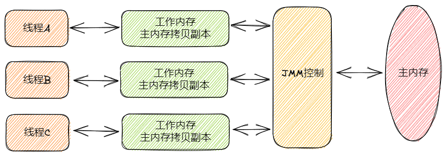

# Java

## JVM

### 一、JVM的基本介绍

JVM是Java Virtual Machine的缩写，它是一个虚构出来的计算机，一种规范。通过在实际的计算机上仿真模拟各类计算机功能实现。

可以理解JVM其实就类似一台小电脑运行在windows或Linux这些操作系统环境下即可。它直接和操作系统进行交互，与硬件不直接交互，而操作系统可以帮我们完成和硬件进行交互的工作。

#### 1.1 Java文件是如何被运行的

比如我们现在写了一个HelloWorld.java，抛开这个HelloWorld.java所有东西不谈，这就类似一个文本文件，只是这个文件它写的都是英文，而且有一定的缩进而已。我们的JVM是不认识文本文件的，所以需要对这个文本文件进行编译，让其成为一个JVM会读的二进制文件HelloWolrd.class。

1. 类加载器

   如果JVM想要执行这个.class文件，我们需要将其装进一个**类加载器**中，它就像一个搬运工一样，会把所有的.class文件全部搬进JVM里面来。

2. 方法区

   方法区是用于存放类似于元数据信息方面的数据，比如类信息，常量，静态变量，编译后代码等等。类加载器将.class文件搬过来就是先丢到这一块上。

3. 堆

   堆主要存放一些存储的数据，比如对象实例，数组...等，它和方法区都同属于**线程共享区域**。也就是说它们都是**线程不安全**的

4. 栈

   栈是代码运行空间，编写的每一个方法都会放到栈里面运行。

5. 程序计数器

   主要就是完成一个加载工作，类似一个指针一样的，指向下一行我们需要执行的代码。和栈一样，都是**线程独享**的，就是说每一个栈都会有自己对应的一块区域而不会存在并发和多线程的问题。

小总结

1. Java文件经过编译后变成.class字节码文件
2. 字节码文件通过类加载器被搬运到JVM虚拟机中
3. 虚拟机主要的5大块：方法区，堆都为线程共享区域，有线程安全问题，栈、本地方法栈和计数器都是独享区域，不存在线程安全问题，而JVM的调优主要就是围绕堆，栈两大块进行。

#### 1.2 简单的代码例子

执行main方法的步骤如下：

1. 编译好App.java后得到App.class文件，执行App.class文件，系统会启动一个JVM进程，从classpath路径中找到一个名为App.class的二进制文件，将App的类信息加载到运行时数据区的方法区内，这个过程叫做App类的加载。
2. JVM找到App的主程序入口，执行main方法。
3. 这个main中的第一条语句为Student student = new Student("tellUrDream")，就是让JVM创建一个Student对象，但是这个时候方法区中是没有Student类的信息的，所以JVM马上加载Student类，把Student类的信息放到方法区中。
4. 加载完Student类后，JVM在堆中为一个新的Student实例分配内存，然后调用构造函数初始化Student实例，这个Student实例持有**指向方法区中的Student类的类型信息**的引用。
5. 执行student.sayName();时，JVM根据student的引用找到student对象，然后根据student对象持有的引用定位到方法区中student类的类型信息的方法表，获得sayName()的字节码地址。
6. 执行sayName()。

通俗来讲，只需要知道对象实例初始化时会去方法区中找类信息，完成后再到栈哪里去运行方法。找方法就在方法表中找。

### 二、类加载器的介绍

之前也提到了类加载器时负责加载.class文件的，它们在文件开头会有特定的文件标识，将class文件字节码内容加载到内存中，并将这些内容转换成方法区中的运行时数据结构，并且ClassLoader只负责class文件的加载，而是否能够运行则由Execution Engine来决定

#### 2.1 类加载器的流程

从类加载到虚拟机内存中开始，到释放内存共有7个步骤：加载，验证，准备，解析，初始化，使用，卸载。其中验证，准备，解析三部分统称为连接

##### 2.1.1 加载

1. 将class文件加载到内存
2. 将静态数据结构转化成方法区中运行时的数据结构
3. 在堆中生成一个代表这个类的java.lang.Class对象作为数据访问的入口

## JMM

### 什么是JMM

> JMM就是Java内存模型（Java Memory Model）。因为在不同的硬件生产商和不同的操作系统下，内存的访问有一定的差异，所以会造成相同的代码运行在不同的系统上会出现各种问题。所以**Java内存模型（JMM）屏蔽掉各种硬件和操作系统的内存访问差异，以实现让Java程序在各种平台下都能达到一致的并发效果。**

Java内存模型规定**所有的变量都存储在主内存**中，包括实例变量，静态变量，但是不包括局部变量和方法参数。每个线程都有自己的工作内存，**线程的工作内存保存了该线程用到的变量和主内存的副本拷贝，线程对变量的操作都在工作内存中进行。线程不能直接读写主内存中的变量。**

不同的线程之间也无法访问对方工作内存的变量。线程之间变量值的传递均需要通过主内存来完成。

如果听起来抽象的话，看看下面这张图，会直观一点：



## AQS详解

AQS的全称为`AbstractQueuedSynchronizer`，翻译过来的意思就是抽象队列同步器。这个列再`java.util.concurrent.locks`包下面。

AQS就是一个抽象类，主要用来构建锁和同步器。

```java
public abstract class AbstactQueuedSynchronizer extends AbstractOwnablesSynchronizer implement java.io.Serializable {    
}
```

AQS为构建锁和同步器提供了一些通用功能的实现，因此，使用AQS能简单且高效地构造出应用广泛地大量同步器，比如我们提到的`ReentranLock`，`Semaphore`，其他的诸如`ReentrantReadWriteLock`，`SynchronousQueue`等等皆是基于AQS的。

### AQS原理

在面试中被问到并发知识的时候，大多都会被问道“请你说一下自己对AQS原理的理解”。下面给大家一个示例供大家参考，面试不是背题，大家一定要加入自己的思想，即使加入不了自己的思想也要保证自己能够通俗的讲出来而不是背出来。

### AQS核心思想

AQS核心思想是，如果被请求的共享资源空闲，则将当前请求资源的线程设置为有效的工作线程，并将共享资源设置为锁定状态。如果被请求的共享资源被占用，那么就需要一套线程阻塞等待以及被唤醒时锁分配的机制，这个机制AQS时基于CLH锁实现的。

CLH锁是对自旋锁的一种改进，是一个虚拟的双向队列（虚拟的双向队列即不存在队列实例，仅存在节点之间的关联关系），暂时获取不到锁的线程将被加入到该队列中。AQS将每条请求共享资源的线程装成一个CLH队列锁的一个结点（Node）来实现锁的分配。再CLH队列锁中，一个节点表示一个线程，它保存着线程的引用（thread）、当前节点在队列中的状态（waitStatus）、前驱节点（pre）、后继节点（next）。

AQS使用int成员变量`state`表示同步状态，通过内置的**线程等待队列**来完成获取资源线程的排队工作。

`state`变量由`volatile`修饰，用于展示当前临界资源的获锁情况。

```java
// 共享变量，使用volatile修饰保证线程可见性
private volatile int state
```

另外，状态信息`state`可以通过`protected`类型的`getState()`、`setState()`和`compareAndSetState()`进行操作。并且，这几个方法都是`final`修饰的，在子类中无法被重写。

```java
//返回同步状态的当前值
protected final int getState() {
     return state;
}
 // 设置同步状态的值
protected final void setState(int newState) {
     state = newState;
}
//原子地（CAS操作）将同步状态值设置为给定值update如果当前同步状态的值等于expect（期望值）
protected final boolean compareAndSetState(int expect, int update) {
      return unsafe.compareAndSwapInt(this, stateOffset, expect, update);
}
```

以`ReentrantLock`为例，`state`初始值为0，表示未锁定状态，A线程`lock()`时，会调用`tryAcquire()`独占该锁并将`state+1`。此后，其他线程再`tryAcquire（）`时就会失败，知道A线程`unlock()`到`state=0`（即释放锁为止），其他线程才有机会获取该锁。当然，释放锁之前，A线程自己时可以重复获取此锁的（`state`会累加），这就是可重入的概念。但要注意，获取多少次就要释放多少次，这样才能保证state是能回到零态的。

再以`CountDownLatch`为例，任务分为N个子进程去执行，`state`也初始化为N（注意N要与线程个数一致）。这N个子线程时并行执行的，每个子线程执行完后`countDown()`一次，state会CAS（Compare and Swap）减1。等到所以子线程都执行完后（即`state=0`）会`unpark()`主调用线程，然后主调用线程会从`await`函数返回，继续后余动作。

### AQS资源共享方式

AQS定义两种资源共享方式：`Exclusive`（独占，只有一个线程能执行，如`ReentrantLock`）和`Share`（共享，多个线程可同时执行，如`Semaphore/CountDownLatch`）。

一般来说，自定义同步器的共享方式要么是独占，要么是共享，他们也只需实现`tryAcquire-tryRelease`、`tryAcquireShared-tryReleaseShared`中的一种即可。但是AQS也支持自定义同步器同步实现独占和共享两种方式，如`ReentrantReadWriteLock`。

### 自定义同步器

同步器的设计是基于模板方法模式的，如果需要自定义同步器一般的方式是这样（模板方法模式很经典的一个应用）：

1. 使用者继承`AbstractQueuedSynchronizer`并重写指定方法。
2. 将AQS组合在自定义同步组件的实现中，并调用其模板方法，而这些模板方法会调用使用者重写的方法。

这和我们以往通过实现接口的方式有很大区别，这是模板方法模式很经典的一个运用。

AQS使用了模板方法模式，自定义同步器时需要重写下面几个AQS提供的钩子方法：

```java
//独占方式。尝试获取资源，成功则返回true，失败则返回false。
protected boolean tryAcquire(int)
//独占方式。尝试释放资源，成功则返回true，失败则返回false。
protected boolean tryRelease(int)
//共享方式。尝试获取资源。负数表示失败；0表示成功，但没有剩余可用资源；正数表示成功，且有剩余资源。
protected int tryAcquireShared(int)
//共享方式。尝试释放资源，成功则返回true，失败则返回false。
protected boolean tryReleaseShared(int)
//该线程是否正在独占资源。只有用到condition才需要去实现它。
protected boolean isHeldExclusively()
```

**什么是钩子方法呢？** 钩子方法是一种被声明在抽象类中的方法，一般使用 `protected` 关键字修饰，它可以是空方法（由子类实现），也可以是默认实现的方法。模板设计模式通过钩子方法控制固定步骤的实现。

除了上面提到的钩子方法之外，AQS 类中的其他方法都是 `final` ，所以无法被其他类重写。

