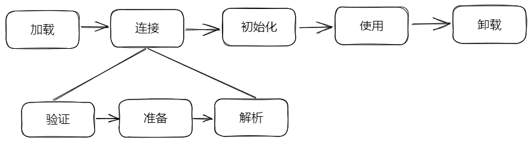
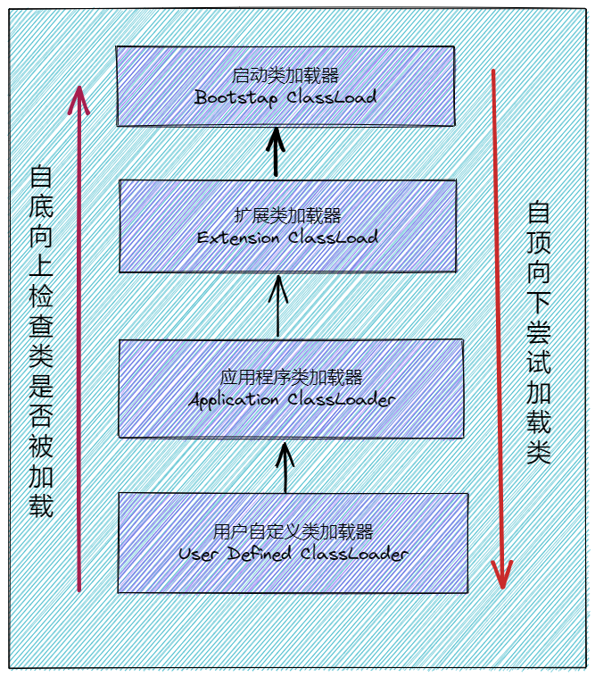
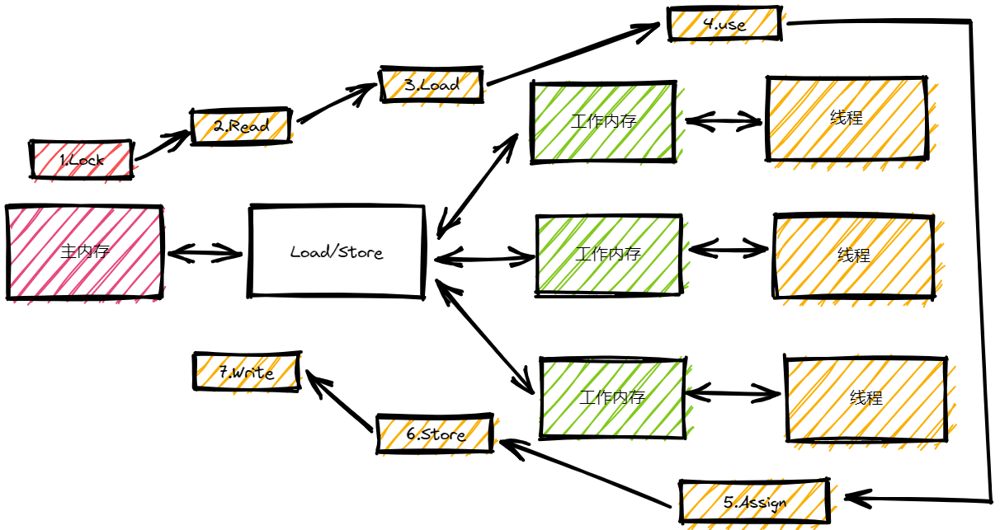
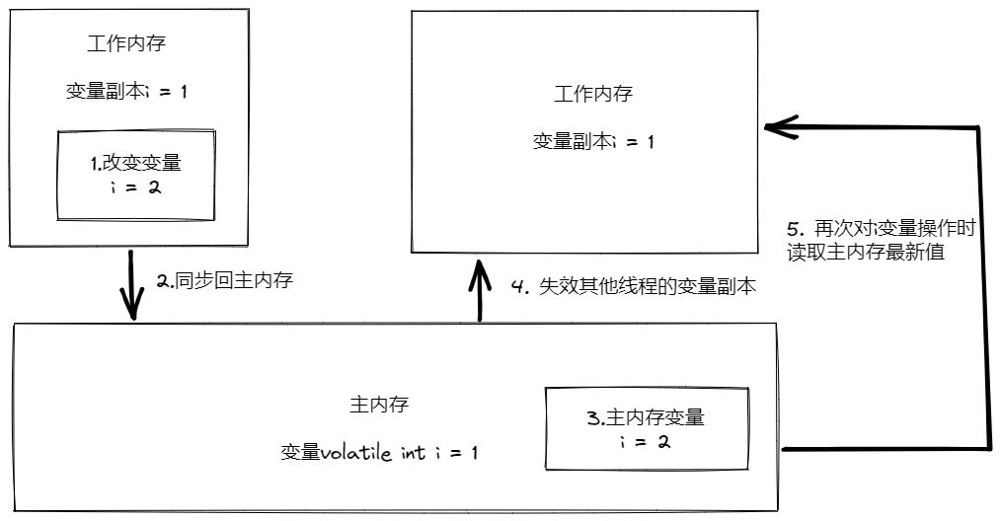
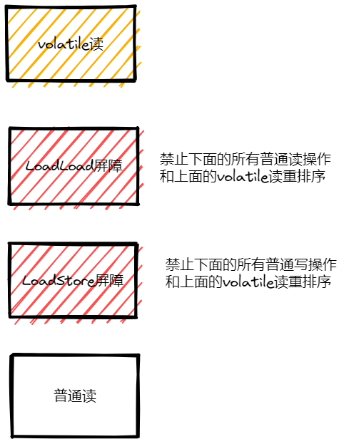
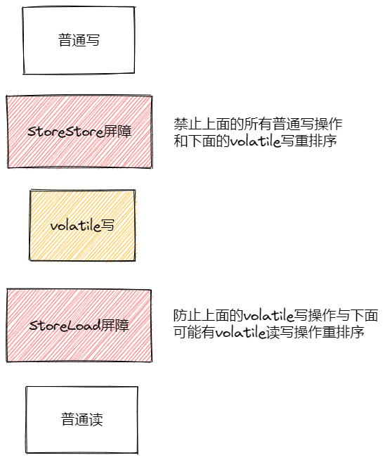

# Java

## JVM

### 一、JVM的基本介绍

JVM是Java Virtual Machine的缩写，它是一个虚构出来的计算机，一种规范。通过在实际的计算机上仿真模拟各类计算机功能实现。

可以理解JVM其实就类似一台小电脑运行在windows或Linux这些操作系统环境下即可。它直接和操作系统进行交互，与硬件不直接交互，而操作系统可以帮我们完成和硬件进行交互的工作。

#### 1.1 Java文件是如何被运行的

比如我们现在写了一个HelloWorld.java，抛开这个HelloWorld.java所有东西不谈，这就类似一个文本文件，只是这个文件它写的都是英文，而且有一定的缩进而已。我们的JVM是不认识文本文件的，所以需要对这个文本文件进行编译，让其成为一个JVM会读的二进制文件HelloWolrd.class。

1. 类加载器

   如果JVM想要执行这个.class文件，我们需要将其装进一个**类加载器**中，它就像一个搬运工一样，会把所有的.class文件全部搬进JVM里面来。

2. 方法区

   方法区是用于存放类似于元数据信息方面的数据，比如类信息，常量，静态变量，编译后代码等等。类加载器将.class文件搬过来就是先丢到这一块上。

3. 堆

   堆主要存放一些存储的数据，比如对象实例，数组...等，它和方法区都同属于**线程共享区域**。也就是说它们都是**线程不安全**的

4. 栈

   栈是代码运行空间，编写的每一个方法都会放到栈里面运行。

5. 程序计数器

   主要就是完成一个加载工作，类似一个指针一样的，指向下一行我们需要执行的代码。和栈一样，都是**线程独享**的，就是说每一个栈都会有自己对应的一块区域而不会存在并发和多线程的问题。

小总结

1. Java文件经过编译后变成.class字节码文件
2. 字节码文件通过类加载器被搬运到JVM虚拟机中
3. 虚拟机主要的5大块：方法区，堆都为线程共享区域，有线程安全问题，栈、本地方法栈和计数器都是独享区域，不存在线程安全问题，而JVM的调优主要就是围绕堆，栈两大块进行。

#### 1.2 简单的代码例子

执行main方法的步骤如下：

1. 编译好App.java后得到App.class文件，执行App.class文件，系统会启动一个JVM进程，从classpath路径中找到一个名为App.class的二进制文件，将App的类信息加载到运行时数据区的方法区内，这个过程叫做App类的加载。
2. JVM找到App的主程序入口，执行main方法。
3. 这个main中的第一条语句为Student student = new Student("tellUrDream")，就是让JVM创建一个Student对象，但是这个时候方法区中是没有Student类的信息的，所以JVM马上加载Student类，把Student类的信息放到方法区中。
4. 加载完Student类后，JVM在堆中为一个新的Student实例分配内存，然后调用构造函数初始化Student实例，这个Student实例持有**指向方法区中的Student类的类型信息**的引用。
5. 执行student.sayName();时，JVM根据student的引用找到student对象，然后根据student对象持有的引用定位到方法区中student类的类型信息的方法表，获得sayName()的字节码地址。
6. 执行sayName()。

通俗来讲，只需要知道对象实例初始化时会去方法区中找类信息，完成后再到栈哪里去运行方法。找方法就在方法表中找。

### 类加载机制

> Java虚拟机把描述类的数据从Class文件加载到内存，并对数据进行校验、转换解析和初始化，最终形成可以被虚拟机直接使用的Java类型，这个过程被称作虚拟机类的加载机制。

#### 类的声明周期

一个类的完整生命周期如下：



#### 类的加载过程

Class文件需要加载到虚拟机中之后才能运行和使用，那么虚拟机是如何加载这些Class文件呢？

系统加载Class类型的文件主要三步：加载→连接→初始化。连接过程又可分为三步：验证→准备→解析。

#### 加载：查找并加载类的二进制数据

类加载过程的第一步，主要完成下面三件事：

1. 通过全类名获取定义此类的二进制字节流；
2. 将字节流所代表的静态存储结构转换为方法区的运行时数据结构；
3. 在内存中生成一个代表该类的Class对象，作为方法区这些数据的访问入口。

#### 验证：确保被加载的类的正确性

验证是连接阶段的第一步，这一阶段的目的是为了确保Class文件的字节流中包含的信息符合当前虚拟机的要求，并且不会危害虚拟机自身的安全。验证阶段大致会完成4个阶段的检验动作：

- **文件格式校验：**验证字节流是否符合Class文件格式的规范；例如：是否以`0xCAFEBABE`开头、主次版本号是否在当前虚拟机的处理范围之内、常量池中的常量是否又不被支持的类型。
- **元数据验证：**对字节码描述的信息进行语义分析（注意：对比`javac`编译阶段的语义分析），以保证其描述的信息符合Java语言规范的要求；例如，这个类是否有父类，除了`java.lang.Object`之外。
- **字节码验证：**通过数据流和控制流分析，确定程序语义是否合法的、符合逻辑的。
- **符号引用验证：**确保解析动作能正确执行。

验证阶段是非常重要的，但不是必须的，它对程序运行期没有影响，如果所引用的累经过反复验证，那么可以考虑采用`-Xverifynone`参数来关闭大部分的类验证措施，以缩短虚拟机类加载的时间。

#### 准备：为类的静态变量分配内存，并将其初始化为默认值

准备阶段是正式为类变量分配内存并设置类变量初始值的阶段，这些内存都将在方法区中分配。对于该阶段有以下几点需要注意：

1. 这时候进行内存分配的仅包括类变量（Class Variables，即静态变量，被`static`关键字修饰的变量，只与类相关，因此被称为类变量），而不包括实例变量。实例变量会在对象实例化时随着对象一块分配在Java堆中。
2. 从概念上讲，类变量所使用的内存都应当在**方法区**中进行分配。不过有一点需要注意的时：JDK7之前，HotSpot使用永久代来实现方法区的时候，实现时完全符合这种逻辑概念的。 而在 JDK 7 及之后，HotSpot 已经把原本放在永久代的字符串常量池、静态变量等移动到堆中，这个时候类变量则会随着 Class 对象一起存放在 Java 堆中。
3. 这里所设置的初始值”通常情况“下是数据类型默认的零值（如0、0L、null、false等），比如我们定义了`public static int value=111`，那么value变量在准备阶段的初始值就是0而不是111（初始化阶段才会赋值）。特殊情况：比如给value变量加上了final关键字`public static final int value=111`，那么准备解读那value的值就会被赋值为111。

基本数据类型的零值 ：


#### 解析：把类中的符号引用转换为直接引用

**解析阶段是虚拟机将常量池内的符号引用替换为直接引用的过程**，解析动作主要针对类或接口、字段、类方法、接口方法、方法类型、方法句柄和调用限定符7类符号引用进行。符号引用就是一组符号来描述目标，可以是任何字面量。

**直接引用**就是直接指向目标的指针、相对偏移量或一个间接定位到目标的句柄。在程序实际运行时，只有符号引用是不够的，举个例子：在程序执行方法时，系统需要明确知道这个方法所在的位置。Java 虚拟机为每个类都准备了一张方法表来存放类中所有的方法。当需要调用一个类的方法的时候，只要知道这个方法在方法表中的偏移量就可以直接调用该方法了。通过解析操作符号引用就可以直接转变为目标方法在类中方法表的位置，从而使得方法可以被调用。

#### 初始化：对类的静态变量，静态代码块执行初始化操作

初始化，为类的静态变量赋予正确的初始值，JVM负责堆类进行初始化，主要对类变量进行初始化。在Java中对类变量进行初始值的设定有两种方法：

- 声明类变量的指定初始值
- 使用静态代码块为类变量指定初始值

##### 类初始化的操作

- 假如这个类还没有被加载和连接，则程序先加载并连接该类
- 假如该类的直接父类还没有被初始化，则先初始化其直接父类
- 假如类中有初始化语句，则系统依次执行这些初始化语句

##### 触发类初始化的实际

只有当对类的主动使用的时候才会导致类的初始化，类的主动使用包括以下六种：

- 使用new关键字实例化对象的时候；
- 读取或设置一个类型的静态字段（被final修饰、已在编译器把结果放入常量池的静态字段除外）的时候；
- 调用一个类型的静态方法的时候；
- 使用java.lang.reflect包的方法对类型进行反射调用的时候，如果类型没有进行过初始化，则需要先触发其初始化；
- 当初始化类的时候，如果发现其父类还有没有进行过初始化，则需要先触发其父类的初始化；
- 当虚拟机启动时，用户需要指定一个执行的主类（包含main()方法的那个类），虚拟机会先初始化这个主类。

##### 以下几种情况不会执行类初始化

1. 通过子类引用父类的静态字段，只会触发父类的初始化，而不会触发子类的初始化；
2. 定义对象数组，不会触发该类的初始化；
3. 常量在编译期间会存入调用类的常量池中，本质并没有直接引用定义常量的类，不会触发定义常量所在的类；
4. 通过类名获取Class对象，不会触发类的初始化；
5. 通过Class.forName加载指定类时，如果指定参数initialize为false时，也不会触发类初始化，其实这个参数时告诉虚拟机，是否要对类进行初始化；
6. 通过ClassLoader默认的loadClass方法，也不会触发初始化动作。

#### 使用

类访问方法区内的数据结构的接口，对象是Heap区的数据。

#### 卸载

卸载类即该类的Class对象被GC。

卸载类需要满足的3个要求：

1. 该类所有的实例对象都已经被GC，也就是说堆不存在该类的实例对象。
2. 该类没有在其他地方被引用。
3. 该类的类加载器的实例已经被GC

所以，在JVM生命周期内，由JVM自带的类加载器加载的类是不会被卸载的。但是我们自定义的类加载器加载的类是可能被卸载的。

只要想通一点就好，jdk自带的`BootstrapClassLoader`，`ExtClassLoader`，`AppClassLoader`负责加载jdk提供的类，所以它们（类加载器的实例）肯定不会被回收。而我们自定义的类加载器实例是可以被回收的，所以使用我们自定义类加载器加载的类是可以被卸载掉的。

### 类加载器详解

#### 类加载器总结

JVM中内置了三个重要的ClassLoader，除了BootstrapClassLoader，其他类加载器均由Java实现且全部继承自`java.lang.ClassLoader`：

1. BootstrapClassLoader（启动类加载器）：最顶层的加载类，由C++实现，负责加载`%JAVA_HOME%/lib`目录下的jar包和类或者被`-Xbootclasspath`参数指定的路径下的所有类；
2. ExtensionClassLoader（扩展类加载器）：主要负责加载`%JRE_HOME%/lib/ext`目录下的jar包和类，或被`java.ext.dirs`系统变量所指定的路径下的jar包；
3. AppClassLoader（应用程序类加载器）：面向我们用户的加载器，负责加载当前应用classpath下的所有jar包和类。

#### 双亲委派模型

每一个类都有一个对应它得类加载器。系统中的ClassLoader在协同工作的时候会默认使用`双亲委派模型`。即在类加载的时候，系统会首先判断当前类是否被加载过。已经被加载的类会直接返回，否则才会尝试加载。加载的时候，首先会把该请求委派给父类加载器的`loadclass()`处理，因此所有的请求最终都应该传送到顶层的启动类加载器`BootstapClassLoader`中。当父类加载器无法处理时，才由自己来处理。当父类加载器为null时，会启动类加载器`BootstapClassLoader`作为父类加载器。



##### 双亲委派模型的好处

双亲委派模型保证了Java程序的稳定运行，可以避免类的重复加载（JVM区分不同类的方式不仅仅根据类名，相同的类文件被不同的类加载器产生的是两个不同的类），也保证了Java的核心API不被篡改。如果没有使用双亲委派模型，而是每个类加载器加载自己的话就会出现一些问题，比如我们编写一个称为`java.lang.Object`类的话，那么程序运行的时候，系统就会出现多个不同的`Object`类。

##### 自定义类加载器

除了`BootstapClassLoader`其他类均由Java实现且全部继承自`java.lang.ClassLoader`。如果我们要定义自己的类加载器，很明显需要继承`ClassLoader`。

## JMM

### 什么是JMM

> JMM就是Java内存模型（Java Memory Model）。因为在不同的硬件生产商和不同的操作系统下，内存的访问有一定的差异，所以会造成相同的代码运行在不同的系统上会出现各种问题。所以**Java内存模型（JMM）屏蔽掉各种硬件和操作系统的内存访问差异，以实现让Java程序在各种平台下都能达到一致的并发效果。**

Java内存模型规定**所有的变量都存储在主内存**中，包括实例变量，静态变量，但是不包括局部变量和方法参数。每个线程都有自己的工作内存，**线程的工作内存保存了该线程用到的变量和主内存的副本拷贝，线程对变量的操作都在工作内存中进行。线程不能直接读写主内存中的变量。**

不同的线程之间也无法访问对方工作内存的变量。线程之间变量值的传递均需要通过主内存来完成。

如果听起来抽象的话，看看下面这张图，会直观一点：


每个线程的工作内存都是独立，线程操作数据只能在工作内存中进行，然后刷回到主存。这是Java内存模型定义的线程基本工作方式。

> Tip：这里有些人会把Java内存模型误解为Java内存结构，然后回答到堆、栈、GC垃圾回收，最后喝面试官想问的问题相差甚远。**实际上一般问到Java内存模型都是想问多线程，Java并发相关的问题。**

### JMM定义了什么

整个Java内存模型实际上是围绕着三个特征建立起来的。分别是：原子性、可见性、有序性。这三个特征可谓是整个Java并发的基础。

#### 原子性

****

原子性指的是一个操作是不可分割的，不可中断的，一个线程在执行时不会被其他线程干扰。

下面几句代码能保证原子性吗？

```java
int i = 2;
int j = i;
i++;
i = i + 1;
```

第一句是基本类型赋值操作，必定是原子性操作。

第二句先读取i的值，再赋值到j，两步操作，不能保证原子性。

第三和第四句其实是等效的，先读取i的值，再i+1，最后赋值到i，三步操作了，不能保证原子性。

JMM只能保证基本的原子性，如果要保证一个代码块的原子性，可以使用monitorenter和moniterexit两个字节码指令，也就是sychronized关键字。因此在synchronized块之间的操作都是原子性的。

#### 可见性

****

可见性指当一个线程修改共享变量的值，其他线程能够立即知道被修改了。Java是利用volatile关键字来提供可见性的。当变量被volatile修饰时，这个变量被修改后会立刻刷新到主内存，当其他线程需要读取该变量时，会去主内存中读取新值。而不同变量则不能保证这一点。

除了volatile关键字之外，final和synchronized也能实现可见性。

sychronized的原理是，在执行完，进去unlock之前，必须将共享变量同步到主内存中。

final修饰的字段，一旦初始化完成，如果没有对象逸出（指对象未初始化完成就可以被别的线程使用），那么对于其他线程都是可见的。

#### 有序性

****

在Java中，可以使用synchronized或者volatile保证多线程之间操作的有序性。实现原理有些区别：

volatile关键字是使用内存屏障达到禁止指令重排序，以保证有序性。

synchronized的原理是，一个线程lock之后，必须unlock，其他线程才可以重新lock，使得被synchronized包住的代码块在多线程之间是串行执行的。

### 八种内存交互操作

画张图来直观了解一下：



- lock（锁定），作用于**主内存**中的变量，把变量标识为线程独占的状态。
- read（读取），作用于**主内存**的变量，把变量的值从主内存传输到线程的工作内存中，以便下一步的load操作使用。
- load（加载），作用于**工作内存**的变量，把**read**操作主存的变量放入到工作内存的变量副本中。
- use（使用），作用于**工作内存**的变量，把工作内存中的变量传输到执行引擎，每当虚拟机遇到一个需要使用到变量的值的字节码指令时会将执行这个操作。
- assign（赋值），作用于**工作内存**的变量，它把一个从执行引擎中接口到的值赋值给工作内存的变量副本中，每当虚拟机遇到一个给变量赋值的字节码指令时会将执行这个操作。
- store（存储），作用于**工作内存**中的变量，它把一个从工作内存中一个变量的值传送到主内存中，以便后续的write使用。
- write（写入），作用于**主内存**中的变量，它把**store**操作从工作内存中得到的变量的值放入主内存的变量中。
- unlock（解锁），作用于**主内存**中的变量，它把一个处于锁定状态的变量释放出来，释放后的变量才可以被其他线程锁定。

补充一下JMM对8中内存交互操作指定的规则：

- 不允许read、load、store、write操作之一单独出现，也就是read操作后必须load，store操作后必须write。
- 不允许线程丢弃他最近的assign操作，即工作内存中的变量数据改变了之后，必须告知主存。
- 不允许线程将没有assign的数据从工作内存同步到主内存。
- 一个新的变量必须约在主内存中诞生，不允许工作内存直接使用一个未被初始化的变量。就是对变量实施use、store操作之前，必须经过load和assign操作。
- 一个变量同一时间只有有一个线程对其进行lock操作。多次lock后，必须执行相同次数的unlock才可以解锁。
- 如果对一个变量进行lock操作，会清空所有工作内存中次变量的值。值执行引擎使用这个变量前，必须重新load活assgin操作初始化变量的值。
- 如果一个变量没有被lock，就不能对其进行unlock操作。也不能unlock一个被其他线程锁住的变量。
- 一个线程对一个变量进行unlock操作之前，必须把次变量同步回主内存。

### 讲一下volatile关键字

很多并发编程都用到了volatile关键字，主要的作用包括两点：

1. 保证线程间变量的可见性；
2. 禁止 CPU进行指令重排序。

#### 可见性

volatile修饰的变量，当一个线程改变了该变量的值，其他线程时立即可见的。普通变量则需重新读取才能获得最新值。



#### volatile一定能保证线程安全吗

先说结论，volatile不一定能保证线程安全。为什么volatile不能保证线程安全呢？很简单，可见性不能保证操作的原子性，前面有说过count++不是原子性操作，会当作三步，先读取count的值，然后+1，最后赋值回count变量。需要保证线程安全的话，需要使用sychronized关键字或者lock锁，给count++这段代码上锁：

```java
private static synchronized void add() {
    count++;
}
```

#### 禁止指令重排序

首先要讲一下as-if-serial语义，不管怎么重排序，（单线程）程序的执行结果不能被改变。

为了使指令更加符合CPU的执行特性，最大限度的发挥机器的性能，提高程序的执行效率，只要程序的最终结果与它顺序化情况的结果相等，那么指令的执行顺序可以与代码逻辑顺序不一致，这个过程就叫做**指令的重排序**。

重排序的种类分为三种，分别是：编译器重排序，指令级并行的重排序，内存系统的重排序。整个过程如下所示：


指令重排序在单线程是没有问题的，不会影响执行结果，而且还提高了性能。但是在多线程的环境下就不能保证一定不会影响执行结果了。

**所以在多线程环境下，就需要禁止指令重排序。**

volatile关键字禁止指令重排序有两层意思：

- 当程序执行到volatile变量的读操作或者写操作时，在其前面的操作的更改肯定全部已经进行，且结果已经对后面的操作可见，在其后面的操作肯定还没有进行。
- 在进行指令优化时，不能将在对volatile变量访问的语句放在其后面执行，也不能把volatile变量后面的语句放到其前面执行。

### volatile禁止指令重排序的原理是什么

首先要讲一下内存屏障，内存屏障可以分为以下几类：

- LoadLoad屏障：对于这样的语句Load1、LoadLoad，Load2。在Load2及后续读取操作要读取的数据被访问前，保证Load1要读取的数据被读取完毕。
- StoreStore屏障：对于这样的语句Store1，StoreStore，Store2，在Store及后续写入操作执行前，保证Store1的写入操作对其他处理器是可见的。
- LoadStore屏障：对于这样的语句Load1，LoadStore，Store2，在Store2及后续读写操作被刷出前，保证Load1要读取的数据被读取完毕。
- StoreLoad屏障：对于这样的语句Store1，StoreLoad，Load2，在Load2及后续所有读取操作执行前，保证Store1的写入对所有处理器可见。

在每个volatile读操作后插入LoadLoad屏障，在读操作后插入LoadStore屏障。



在每个volatile写操作的前面插入一个StoreStore屏障，后面插入一个StoreLoad屏障。



## AQS详解

AQS的全称为`AbstractQueuedSynchronizer`，翻译过来的意思就是抽象队列同步器。这个列再`java.util.concurrent.locks`包下面。

AQS就是一个抽象类，主要用来构建锁和同步器。

```java
public abstract class AbstactQueuedSynchronizer extends AbstractOwnablesSynchronizer implement java.io.Serializable {    
}
```

AQS为构建锁和同步器提供了一些通用功能的实现，因此，使用AQS能简单且高效地构造出应用广泛地大量同步器，比如我们提到的`ReentranLock`，`Semaphore`，其他的诸如`ReentrantReadWriteLock`，`SynchronousQueue`等等皆是基于AQS的。

### AQS原理

在面试中被问到并发知识的时候，大多都会被问道“请你说一下自己对AQS原理的理解”。下面给大家一个示例供大家参考，面试不是背题，大家一定要加入自己的思想，即使加入不了自己的思想也要保证自己能够通俗的讲出来而不是背出来。

### AQS核心思想

AQS核心思想是，如果被请求的共享资源空闲，则将当前请求资源的线程设置为有效的工作线程，并将共享资源设置为锁定状态。如果被请求的共享资源被占用，那么就需要一套线程阻塞等待以及被唤醒时锁分配的机制，这个机制AQS时基于CLH锁实现的。

CLH锁是对自旋锁的一种改进，是一个虚拟的双向队列（虚拟的双向队列即不存在队列实例，仅存在节点之间的关联关系），暂时获取不到锁的线程将被加入到该队列中。AQS将每条请求共享资源的线程装成一个CLH队列锁的一个结点（Node）来实现锁的分配。再CLH队列锁中，一个节点表示一个线程，它保存着线程的引用（thread）、当前节点在队列中的状态（waitStatus）、前驱节点（pre）、后继节点（next）。

AQS使用int成员变量`state`表示同步状态，通过内置的**线程等待队列**来完成获取资源线程的排队工作。

`state`变量由`volatile`修饰，用于展示当前临界资源的获锁情况。

```java
// 共享变量，使用volatile修饰保证线程可见性
private volatile int state
```

另外，状态信息`state`可以通过`protected`类型的`getState()`、`setState()`和`compareAndSetState()`进行操作。并且，这几个方法都是`final`修饰的，在子类中无法被重写。

```java
//返回同步状态的当前值
protected final int getState() {
     return state;
}
 // 设置同步状态的值
protected final void setState(int newState) {
     state = newState;
}
//原子地（CAS操作）将同步状态值设置为给定值update如果当前同步状态的值等于expect（期望值）
protected final boolean compareAndSetState(int expect, int update) {
      return unsafe.compareAndSwapInt(this, stateOffset, expect, update);
}
```

以`ReentrantLock`为例，`state`初始值为0，表示未锁定状态，A线程`lock()`时，会调用`tryAcquire()`独占该锁并将`state+1`。此后，其他线程再`tryAcquire（）`时就会失败，知道A线程`unlock()`到`state=0`（即释放锁为止），其他线程才有机会获取该锁。当然，释放锁之前，A线程自己时可以重复获取此锁的（`state`会累加），这就是可重入的概念。但要注意，获取多少次就要释放多少次，这样才能保证state是能回到零态的。

再以`CountDownLatch`为例，任务分为N个子进程去执行，`state`也初始化为N（注意N要与线程个数一致）。这N个子线程时并行执行的，每个子线程执行完后`countDown()`一次，state会CAS（Compare and Swap）减1。等到所以子线程都执行完后（即`state=0`）会`unpark()`主调用线程，然后主调用线程会从`await`函数返回，继续后余动作。

### AQS资源共享方式

AQS定义两种资源共享方式：`Exclusive`（独占，只有一个线程能执行，如`ReentrantLock`）和`Share`（共享，多个线程可同时执行，如`Semaphore/CountDownLatch`）。

一般来说，自定义同步器的共享方式要么是独占，要么是共享，他们也只需实现`tryAcquire-tryRelease`、`tryAcquireShared-tryReleaseShared`中的一种即可。但是AQS也支持自定义同步器同步实现独占和共享两种方式，如`ReentrantReadWriteLock`。

### 自定义同步器

同步器的设计是基于模板方法模式的，如果需要自定义同步器一般的方式是这样（模板方法模式很经典的一个应用）：

1. 使用者继承`AbstractQueuedSynchronizer`并重写指定方法。
2. 将AQS组合在自定义同步组件的实现中，并调用其模板方法，而这些模板方法会调用使用者重写的方法。

这和我们以往通过实现接口的方式有很大区别，这是模板方法模式很经典的一个运用。

AQS使用了模板方法模式，自定义同步器时需要重写下面几个AQS提供的钩子方法：

```java
//独占方式。尝试获取资源，成功则返回true，失败则返回false。
protected boolean tryAcquire(int)
//独占方式。尝试释放资源，成功则返回true，失败则返回false。
protected boolean tryRelease(int)
//共享方式。尝试获取资源。负数表示失败；0表示成功，但没有剩余可用资源；正数表示成功，且有剩余资源。
protected int tryAcquireShared(int)
//共享方式。尝试释放资源，成功则返回true，失败则返回false。
protected boolean tryReleaseShared(int)
//该线程是否正在独占资源。只有用到condition才需要去实现它。
protected boolean isHeldExclusively()
```

**什么是钩子方法呢？** 钩子方法是一种被声明在抽象类中的方法，一般使用 `protected` 关键字修饰，它可以是空方法（由子类实现），也可以是默认实现的方法。模板设计模式通过钩子方法控制固定步骤的实现。

除了上面提到的钩子方法之外，AQS 类中的其他方法都是 `final` ，所以无法被其他类重写。

